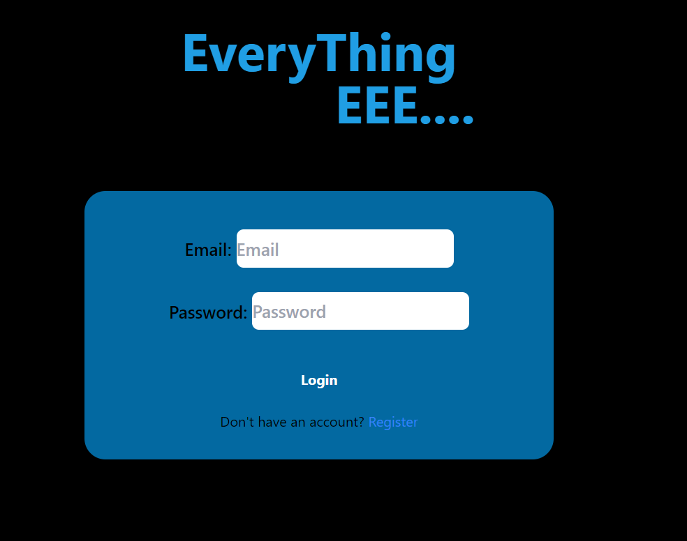
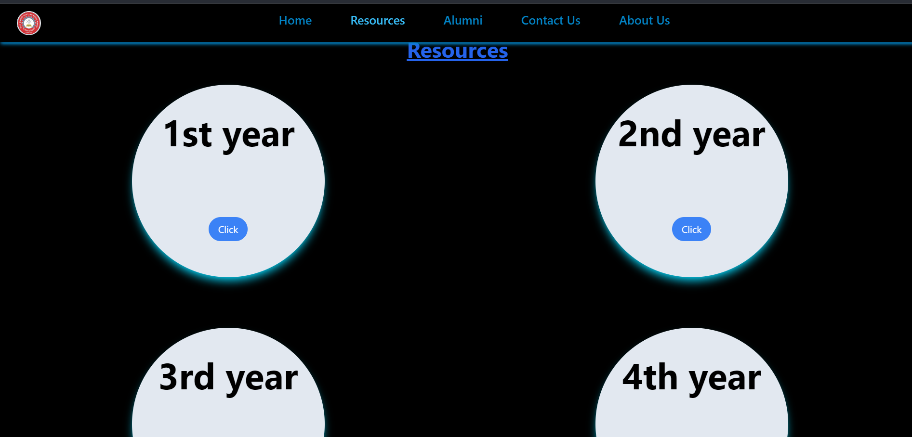
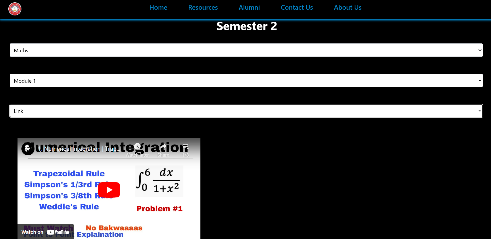

# 🌟 EEE Academic Assistance Website


## 📜 Description

This website helps Electrical and Electronics Engineering (EEE) students access academic resources and connect with alumni. With structured navigation through **years**, **semesters**, **subjects**, and **modules**, students can find study materials quickly and efficiently. The alumni page provides students the opportunity to connect for career guidance and referrals.

## 🚀 Features

### 🎓 Academic Resources
- **Structured Navigation**: Year ➡️ Semester ➡️ Subject ➡️ Module
- **Resources**: Access PDFs, Notes, and YouTube Playlists for deeper understanding.

### 🌐 Alumni Connect
- **Dedicated Alumni Page**: Contact alumni for guidance, job referrals, and networking.

## 📸 Screenshots







## 🛠️ Installation & Setup

1. **Clone the repository**:
   ```bash
   git clone https://github.com/your-username/eee-academic-website.git
   cd eee-academic-website
2.
   ```bash
   npm install
3. Install Dependencies
   ```bash
   npm install emailjs-com
   npm install framer-motion
   npm install -g firebase-tools
   npm i --save @fortawesome/free-solid-svg-icons                                                                            
   npm i --save @fortawesome/free-regular-svg-icons                                                                                                    
   npm i --save @fortawesome/free-brands-svg-icons

4. Ready to run the code
   ```bash
   npm run dev


## 🛠️ Tech Stack

| **Category**         | **Technologies** |
|----------------------|------------------|
| **Frontend**         |   |
| **Database**         |  |
| **Version Control**  |   |
| **Tools**            |  |


🤝 Contributing
We welcome contributions! To contribute:

1. Fork the repository.
2. Create a feature branch: git checkout -b feature-name.
3. Commit your changes: git commit -m "Added feature".
4. Push to your branch: git push origin feature-name.
5. Submit a pull request.
